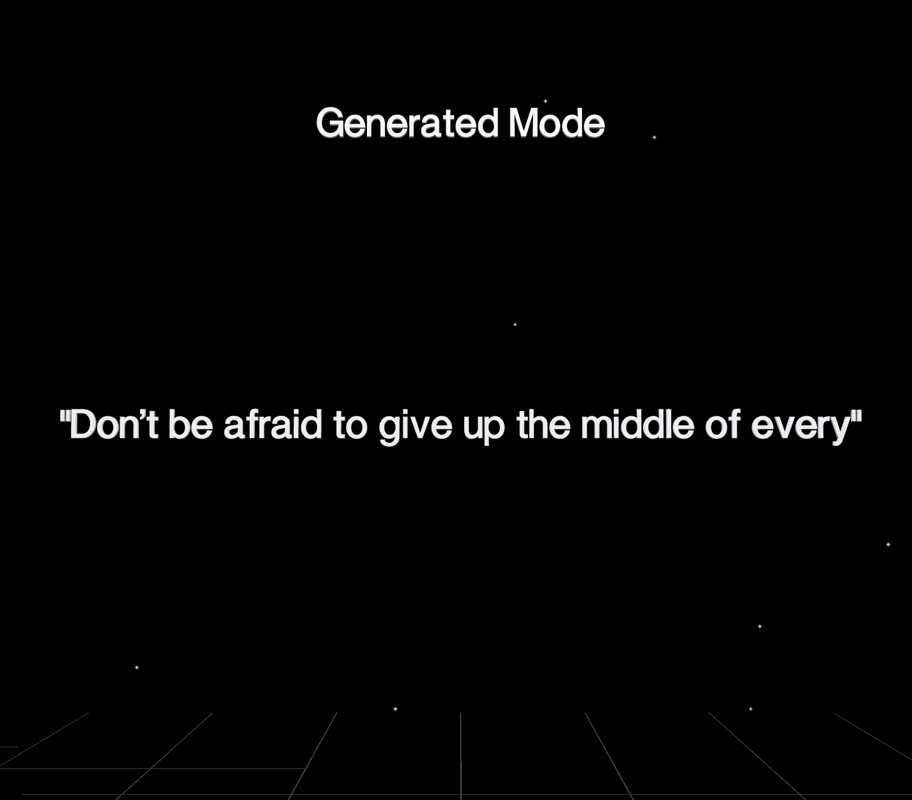

# Markov Motivation

Markov motivation is a game where you customize a model to make nonsensical motivational quotes!
Share your favorite ones on discord.

There are two modes!

## Source Mode

In source mode, you browse through source quotes and mark them to customize the model.

Click Next to browse through quotes.

Click Mark to customize the model with the current quote. It will turn green.

## Generated Mode

Click SwitchMode to see what the model comes up with. You will need to mark some quotes in order to see something here.

## How do I reset the model?

Refresh the page.

## Why?

Reading about transcendental poetry in class, and motivational things keep me going.

### Credits

source quotes from chatGPT

github copilot was clutch

made during the CM Game Jam at UC Santa Cruz, 2023 -- thank you everyone
